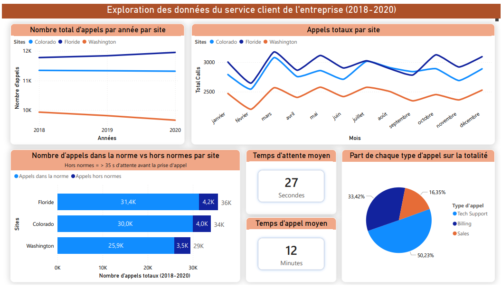
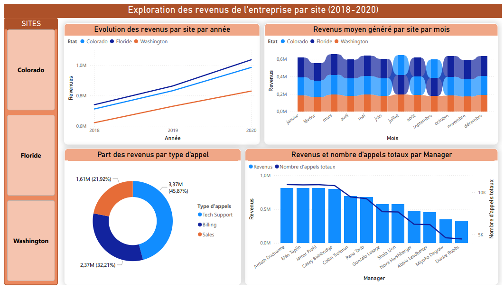
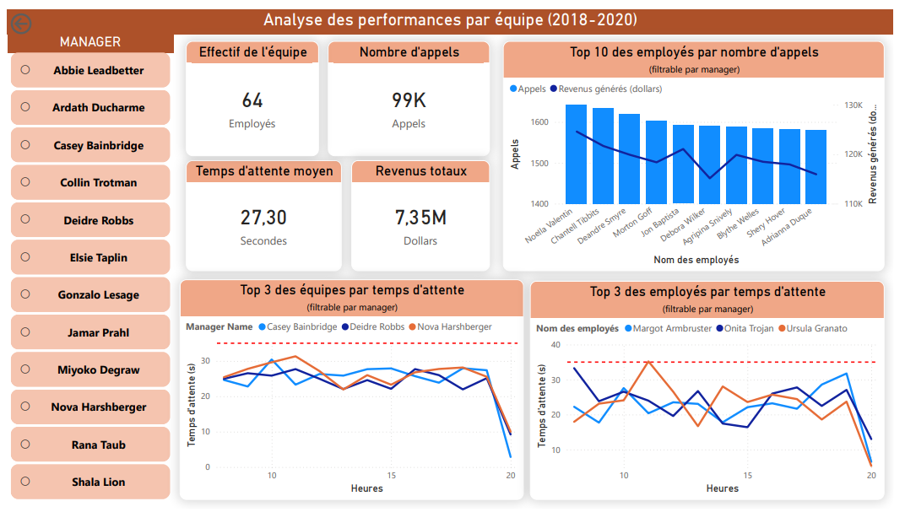

# Analyse d'un centre d'appels externalisé — Power BI

Ce projet présente une analyse de l'activité d'une **entreprise proposant des services externalisés de centre d'appels**, réalisée intégralement et individuellement avec **Power BI**. Il couvre la période **2018–2020** (les données 2021 ayant été écartées en raison d'anomalies détectées lors du nettoyage).

L'analyse s'articule autour de trois axes : la performance du service client, les revenus par site, et les performances individuelles par manager et par équipe.

---

## Structure du projet

```
├── images/                    # Captures des visuels individuels
├── Dashboard_1_ServiceClient.pdf
├── Dashboard_2_Revenus.pdf
├── Dashboard_3_Performances.pdf
└── README.md
```

---

## Rapport 1 — Exploration des données du service client (2018–2020)

> **Problématique : Quel est le volume d'activité par site ? Les temps d'attente sont-ils dans les normes ? Quels types d'appels dominent ?**



---

### Nombre total d'appels par année par site

Ce graphique linéaire compare l'évolution du volume d'appels entre les trois sites (Colorado, Floride, Washington) sur 2018–2020. La **Floride maintient le volume le plus élevé** (autour de 12K appels/an), tandis que Washington affiche un volume nettement inférieur et en légère baisse. Ce visuel permet d'identifier rapidement les sites les plus sollicités et les tendances d'activité.

---

### Appels totaux par site et par mois

Ce graphique linéaire mensuel révèle la **saisonnalité de l'activité** pour chaque site. On observe des pics récurrents en mars et en fin d'année, ainsi qu'un creux marqué en février. Cette lecture mensuelle permet d'anticiper les besoins en ressources humaines selon les périodes.

---

### Appels dans la norme vs hors normes par site

Ce diagramme en barres horizontales distingue les appels respectant le seuil de qualité (moins de 35 secondes d'attente avant prise en charge) de ceux qui le dépassent. Sur les trois sites, environ **12% des appels sont hors normes**, la Floride concentrant le volume absolu le plus élevé avec 4,2K appels hors normes sur la période. Ce visuel met en lumière les axes d'amélioration prioritaires par site.

---

### KPI — Temps d'attente et temps d'appel moyens

Deux indicateurs synthétiques affichent les moyennes globales : **27 secondes** de temps d'attente moyen et **12 minutes** de temps d'appel moyen. Mis en regard avec le seuil de 35 secondes défini comme norme, le temps d'attente moyen reste globalement maîtrisé, bien que certains appels dépassent ce seuil comme le montre le graphique précédent.

---

### Part de chaque type d'appel sur la totalité

Ce graphique en secteurs répartit les appels selon leur nature : **Tech Support (50,23%)**, Billing (33,42%) et Sales (16,35%). Le support technique représente ainsi la moitié de l'activité, ce qui oriente les décisions en matière de formation et de dimensionnement des équipes.

---

## Rapport 2 — Exploration des revenus par site (2018–2020)

> **Problématique : Quels sites génèrent le plus de revenus ? Quelle est la part de chaque type d'appel dans le chiffre d'affaires ? Quels managers sont les plus performants financièrement ?**



---

### Évolution des revenus par site par année

Ce graphique linéaire montre une **croissance continue des revenus** sur les trois sites entre 2018 et 2020. Colorado et Floride affichent des trajectoires quasi parallèles et proches d'1M$ en 2020, tandis que Washington progresse plus lentement. La tendance générale est positive sur l'ensemble de la période.

---

### Revenus moyens générés par site par mois

Ce graphique en aires empilées permet de visualiser la **contribution mensuelle de chaque site au chiffre d'affaires global**. Les revenus restent relativement stables mois après mois, autour de 0,6M$ cumulés, sans saisonnalité marquée — ce qui contraste avec les variations de volume d'appels observées dans le rapport précédent.

---

### Part des revenus par type d'appel

Ce graphique en anneau illustre la **répartition du chiffre d'affaires par nature d'appel** : Tech Support génère 45,87% des revenus (3,37M$), Billing 32,21% (2,37M$) et Sales 21,92% (1,61M$). Bien que le Tech Support soit le plus fréquent et le plus rémunérateur, les appels Sales génèrent proportionnellement plus de valeur par appel que les deux autres catégories.

---

### Revenus et nombre d'appels totaux par manager

Ce graphique combiné croise pour chaque manager les **revenus générés** (barres) et le **volume d'appels traités** (courbe). Il permet d'identifier les managers dont les équipes génèrent le plus de valeur, et de repérer d'éventuels écarts entre volume d'activité et performance financière — un outil utile pour orienter les décisions RH et les objectifs individuels.

---

## Rapport 3 — Analyse des performances par équipe (2018–2020)

> **Problématique : Quels managers et quels employés sont les plus performants ? Les temps d'attente sont-ils homogènes selon les équipes ? Comment les performances évoluent-elles au fil de la journée ?**



Ce rapport est **entièrement filtrable par manager** via un sélecteur interactif, permettant d'isoler les indicateurs d'une équipe spécifique pour une analyse ciblée.

---

### KPI — Effectif, volume d'appels, temps d'attente et revenus globaux

Quatre indicateurs clés posent le cadre de l'analyse : **64 employés**, **99K appels traités**, **27,30 secondes** de temps d'attente moyen et **7,35M$** de revenus générés sur la période. Ces chiffres servent de référence pour évaluer les performances individuelles des managers et de leurs équipes.

---

### Top 10 des employés par nombre d'appels

Ce graphique combiné classe les dix employés les plus actifs en volume d'appels, en superposant les revenus qu'ils ont générés. Il met en évidence que **volume d'appels et revenus ne sont pas toujours corrélés**, certains employés traitant beaucoup d'appels pour des revenus plus modestes et inversement.

---

### Top 3 des équipes et des employés par temps d'attente

Ces deux graphiques linéaires suivent l'évolution du **temps d'attente au fil des heures de la journée** pour les trois équipes et les trois employés affichant les temps d'attente les plus élevés. La ligne rouge matérialise le seuil de 35 secondes. On observe que les temps d'attente tendent à diminuer en fin de journée, et que certains profils dépassent régulièrement le seuil défini — une information directement actionnable pour le management.

---

## Outils & compétences mobilisés

### Préparation des données — Python (VS Code)
Les fichiers sources ont été nettoyés et préparés via un script **Python / pandas** avant intégration dans Power BI :
- Détection et exclusion des données erronées (année 2021 écartée)
- Suppression des **doublons** et des **valeurs manquantes**
- **Changement de type** des colonnes pour assurer la cohérence des données
- Préparation des fichiers pour faciliter leur **fusion dans Power BI Desktop**

### Modélisation & visualisation — Power BI Desktop
- **Power Query** — fusion et transformations complémentaires des fichiers nettoyés
- **DAX** — calcul des KPI, mesures dynamiques, classements et agrégations personnalisées
- **Conception de tableau de bord** — navigation multi-pages, filtres interactifs par manager, choix des visuels adaptés à chaque problématique

---

## 📬 Contact

N'hésitez pas à me contacter pour toute question sur ce projet ou pour échanger sur mon profil.
